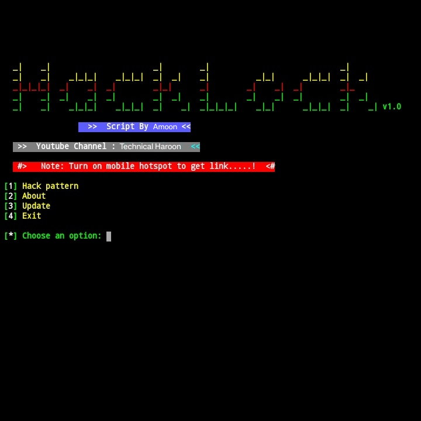
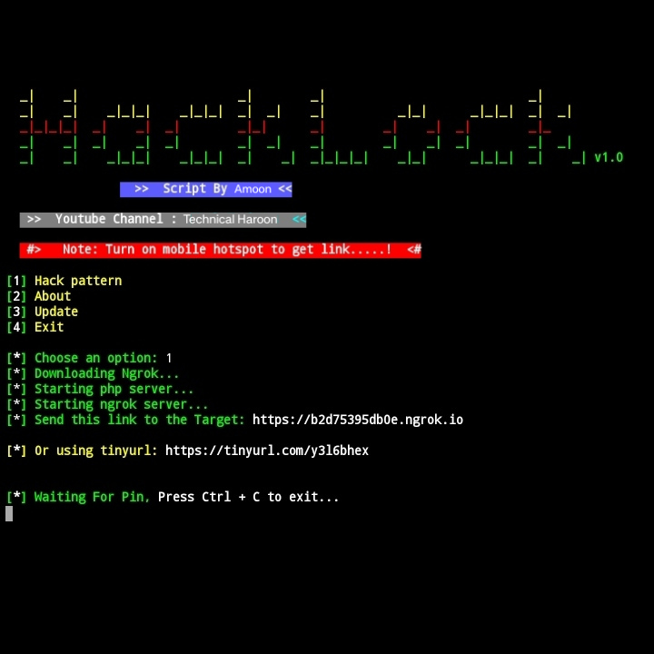

<p align="center">
<a href="https://youtube.com/playlist?list=PLlvIOx22bSWlSo3VyE98joMutWP84jBrT&si=VbR7HyOvskCGYnaY"></a>
</p>
<p align="center">
<a href="https://youtube.com/playlist?list=PLlvIOx22bSWlSo3VyE98joMutWP84jBrT&si=VbR7HyOvskCGYnaY"></a>
<a href="https://youtube.com/playlist?list=PLlvIOx22bSWlSo3VyE98joMutWP84jBrT&si=VbR7HyOvskCGYnaY"></a>
</p>
<p align="center">
<a href="https://youtube.com/playlist?list=PLlvIOx22bSWlSo3VyE98joMutWP84jBrT&si=VbR7HyOvskCGYnaY"></a>
</p>
<p align="center">
<a href="https://youtube.com/playlist?list=PLlvIOx22bSWlSo3VyE98joMutWP84jBrT&si=VbR7HyOvskCGYnaY"></a>
<a href="https://youtube.com/playlist?list=PLlvIOx22bSWlSo3VyE98joMutWP84jBrT&si=VbR7HyOvskCGYnaY"></a>
</p>
<p align="center">
<a href="https://youtube.com/playlist?list=PLlvIOx22bSWlSo3VyE98joMutWP84jBrT&si=VbR7HyOvskCGYnaY"></a>
<a href="https://youtube.com/playlist?list=PLlvIOx22bSWlSo3VyE98joMutWP84jBrT&si=VbR7HyOvskCGYnaY"></a>
<a href="https://youtube.com/playlist?list=PLlvIOx22bSWlSo3VyE98joMutWP84jBrT&si=VbR7HyOvskCGYnaY"></a>
<a href="https://youtube.com/playlist?list=PLlvIOx22bSWlSo3VyE98joMutWP84jBrT&si=VbR7HyOvskCGYnaY"></a>
<a href="https://youtube.com/playlist?list=PLlvIOx22bSWlSo3VyE98joMutWP84jBrT&si=VbR7HyOvskCGYnaY"></a>
<a href="https://youtube.com/playlist?list=PLlvIOx22bSWlSo3VyE98joMutWP84jBrT&si=VbR7HyOvskCGYnaY"></a>
</p>

## ABOUT TOOL :

Hacklock is a bash based script which is officially termux from this tool in just one click you can generate pattern phishing tool which can hack victim pattern and. This tool works on both rooted Android device and Non-rooted Android device.

<p align="center"><a href="https://youtube.com/playlist?list=PLlvIOx22bSWlSo3VyE98joMutWP84jBrT&si=VbR7HyOvskCGYnaY"></a>
</p>

## AVAILABLE ON :

* Termux

### TESTED ON :

* Termux

### REQUIREMENTS :
* internet 100 MB
* php
* storage 1 GB
* ngrok

## FEATURES :
* [+] Real pattern hacking !
* [+] Updated maintainence !
* [+] Ngrok link
* [+] Cloudflare link
* [+] Easy for Beginners !

## INSTALLATION [Termux] :

* `apt-get update -y`
* `apt-get upgrade -y`
* `pkg install python -y`
* `pkg install python2 -y`
* `pkg install git -y`
* `pip install lolcat`
* `git clone https://github.com/Amoonbhatti/hacklock.git`
* `cd $HOME`
* `ls`
* `cd hacklock`
*  `ls`
* `bash setup`
* `bash hacklock.sh`
```
[+]--Now you need internet connection to continue further process and Turn on your device hotspot to get link...

[+]--You will recieve patter pin in below image you can see pattern with numbers

[+]--You can select any option by clicking on your keyboard

[+]--Note:- Don't delete any of the scripts included in core files

```
## USAGE OPTIONS [Termux] :

__HACK PATTERN__ :
- From this option you can create phishing pattern link which get keys of victim pattern after he used this link

__ABOUT__ :
- You can see details of the creator of script

__UPDATE__ :
- From this option you update the script if there is new update available

__EXIT__ :
- From this option you can exit from hacklock tool 

## SCREEN SHOTS [Termux]

<br>
<p align="center">



</p>

## WATCH VIDEO [Termux]

[](https://youtube.com/playlist?list=PLlvIOx22bSWlSo3VyE98joMutWP84jBrT&si=VbR7HyOvskCGYnaY)

## CONNECT WITH US :

<a href="https://youtube.com/playlist?list=PLlvIOx22bSWlSo3VyE98joMutWP84jBrT&si=VbR7HyOvskCGYnaY"></a>
<a href="https://youtube.com/playlist?list=PLlvIOx22bSWlSo3VyE98joMutWP84jBrT&si=VbR7HyOvskCGYnaY"></a>

## BUY ME A COFFEE :

<p align="center">
<a href="#"></a>
</p>

## WARNING : 
***This tool is only for educational purpose. If you use this tool for other purposes except education we will not be responsible in such cases.***
